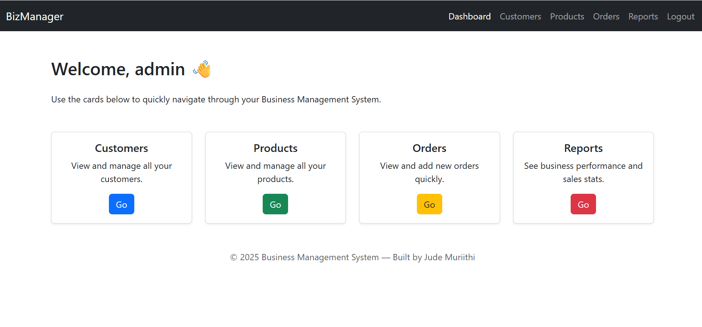

# Business Management System

A **web-based Business Management System** built with **Flask**, **SQLite**, and **Bootstrap 5**.  
This project allows you to manage **customers, products, orders**, and view **sales reports**.

---

## Features

- Admin login system with **Flask-Login**
- **Customers**: Add, edit, delete, view
- **Products**: Add, edit, delete, view
- **Orders**: Add, view all orders
- **Reports**: View total customers, products, orders, revenue, and a chart of orders per product
- **Responsive design** with Bootstrap 5

---

## Screenshots

*Dashboard*



*Customers Page*


*Orders Page*


*Reports Page*


> *Note: Replace the `screenshots/` images with your own screenshots of the app.*

---

## Installation

1. **Clone the repo**:

```bash
git clone https://github.com/your-username/business-management-system.git
cd business-management-system

# 2. Create and activate a virtual environment

# Windows
python -m venv venv
venv\Scripts\activate

# Mac/Linux
python -m venv venv
source venv/bin/activate

# 3. Install dependencies
pip install -r requirements.txt

# 4. Run the application
python app.py

# 5. Open your browser and go to:
# http://127.0.0.1:5000/

# Default admin login:
# Username: admin
# Password: admin123

